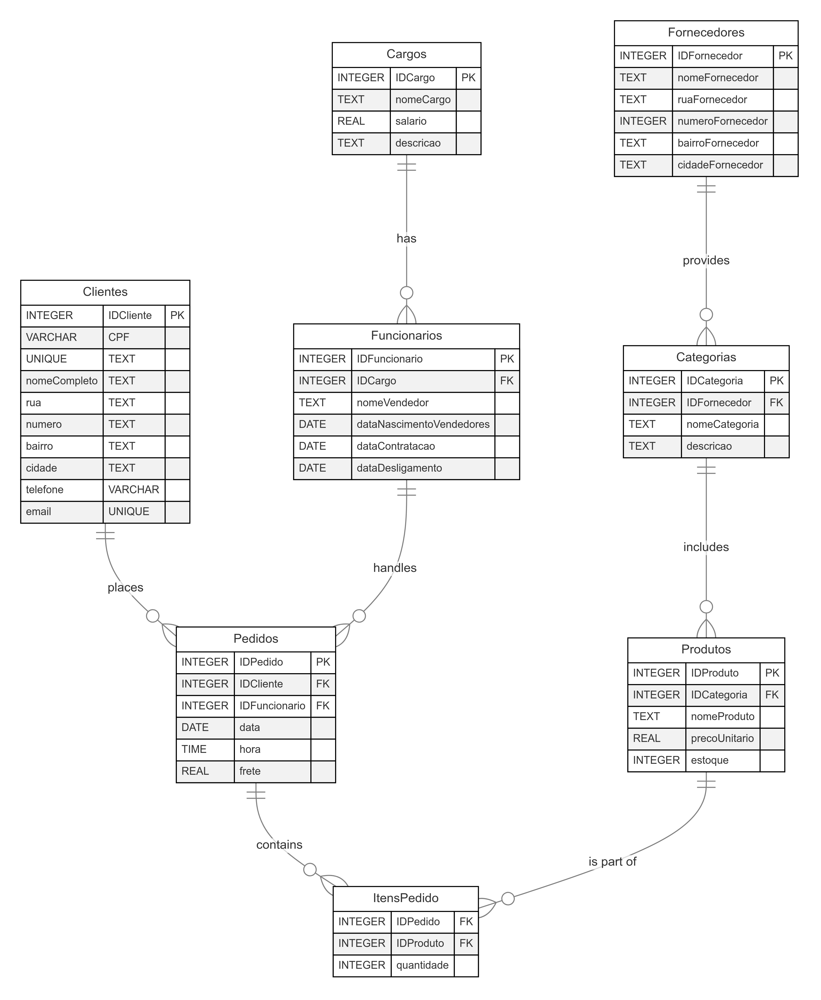

---

# Sistema de Gestão de Vendas - Banco de Dados I

Este projeto faz parte do trabalho prático da disciplina **Banco de Dados I** do curso de **Ciência de Dados** na **Universidade Federal da Paraíba (UFPB)**. O sistema simula uma plataforma de gestão de vendas, incluindo fornecedores, produtos, clientes, pedidos e itens de pedidos, utilizando o MySQL como sistema de gerenciamento de banco de dados.

## Objetivo

O objetivo principal do projeto é a construção de um sistema de banco de dados que permita o gerenciamento eficiente de um sistema de vendas, explorando as funcionalidades e boas práticas do design e manipulação de dados, como criação de tabelas, inserção e recuperação de dados, e gerenciamento de transações.

## Funcionalidades

O sistema permite:

- **Gerenciamento de Cargos**: Registro e manutenção dos cargos dos funcionários, incluindo informações sobre o nome do cargo, salário e descrição.
- **Gerenciamento de Funcionários**: Cadastro e gerenciamento dos dados dos funcionários, como nome, cargo, data de nascimento, contratação e desligamento.
- **Gerenciamento de Fornecedores**: Registro de fornecedores com informações detalhadas, incluindo nome, endereço e cidade.
- **Gerenciamento de Categorias**: Organização dos produtos em categorias específicas (ex: alimentos, eletrônicos, móveis), associadas a fornecedores.
- **Gerenciamento de Produtos**: Registro e manutenção de produtos com detalhes como nome, preço unitário e quantidade em estoque.
- **Gerenciamento de Clientes**: Cadastro de clientes com informações completas, como nome, CPF, endereço e contatos (telefone e e-mail).
- **Gerenciamento de Pedidos**: Registro de pedidos realizados pelos clientes, com detalhes sobre data, hora, funcionário responsável e valor do frete.
- **Gerenciamento de Itens de Pedidos**: Registro dos itens incluídos em cada pedido, com especificação da quantidade e associação ao produto correspondente.

## Tecnologias Utilizadas

- **Python**: Linguagem de programação usada para implementação da lógica de inserção de dados e conexão com o banco de dados.
- **MySQL**: Sistema de gerenciamento de banco de dados relacional.
- **Faker**: Biblioteca Python para geração de dados fictícios (nomes, endereços, produtos, etc.).
- **MySQL Connector**: Biblioteca Python para conexão e execução de comandos no MySQL.

## Estrutura do Banco de Dados  
O banco de dados é composto pelas seguintes tabelas:

- **Cargos**: Armazena as informações sobre os cargos ocupados pelos funcionários, incluindo o nome, salário e descrição do cargo.
- **Funcionários**: Contém os dados dos funcionários, como o nome, cargo, datas de nascimento, contratação e desligamento.
- **Fornecedores**: Contém informações dos fornecedores, incluindo endereço e localização.
- **Categorias**: Armazena as categorias dos produtos, com uma ligação aos fornecedores que as fornecem.
- **Produtos**: Detalha os produtos oferecidos pelo sistema, com informações sobre categoria, preço unitário e quantidade em estoque.
- **Clientes**: Armazena as informações dos clientes, como CPF, nome completo, endereço, telefone e e-mail.
- **Pedidos**: Registra os pedidos feitos pelos clientes, incluindo data, hora e informações do funcionário responsável pelo pedido.
- **ItensPedido**: Armazena os itens que compõem cada pedido, detalhando a quantidade de produtos em cada pedido e suas referências.

### Diagrama ER Simplificado

</img>

## Instalação

### Pré-requisitos

- **Python 3.x** instalado
- **MySQL** instalado e rodando

### Passos para rodar o projeto

1. Clone o repositório:

```bash
git clone git@github.com:pedrohmvv/banco-de-dados-1.git
cd banco-de-dados-1
```

2. Instale as dependências necessárias:

```bash
pip install -r requirements.txt
```

3. Configure as credenciais de acesso ao MySQL no arquivo `.env`.

4. Execute o script para criar o banco de dados e as tabelas:

```bash
python main.py
```

## Uso

Ao executar o sistema, as tabelas serão criadas e automaticamente preenchidas com dados fictícios gerados pela biblioteca Faker. Isso inclui fornecedores, categorias, produtos, clientes, pedidos e itens de pedidos.

O código está preparado para gerenciar transações e garantir a integridade dos dados em casos de falhas durante o processo de inserção.

Aqui está uma nova seção detalhando as futuras implementações:

## Novas Features Planejadas

Com o objetivo de ampliar a funcionalidade e a usabilidade do sistema, estão previstas as seguintes implementações:

- **Painel de Visualização em Streamlit**: A criação de um painel interativo de visualização de dados utilizando a biblioteca Streamlit. Esse painel permitirá que os usuários acompanhem estatísticas e informações importantes em tempo real, como relatórios de vendas, status de estoque, desempenho de funcionários e análise de pedidos. A interface será intuitiva e personalizável, proporcionando uma visão abrangente e detalhada dos dados do sistema.

- **CRUD com Interface de Usuário**: Desenvolvimento de um CRUD (Create, Read, Update, Delete) com uma interface amigável e acessível, facilitando a manipulação dos dados de forma visual. Essa interface permitirá que os usuários realizem operações de cadastro, consulta, atualização e exclusão de registros em tabelas como fornecedores, produtos, clientes e funcionários, sem a necessidade de interagir diretamente com o banco de dados. A proposta é garantir praticidade e eficiência na gestão dos dados, além de melhorar a experiência do usuário.
